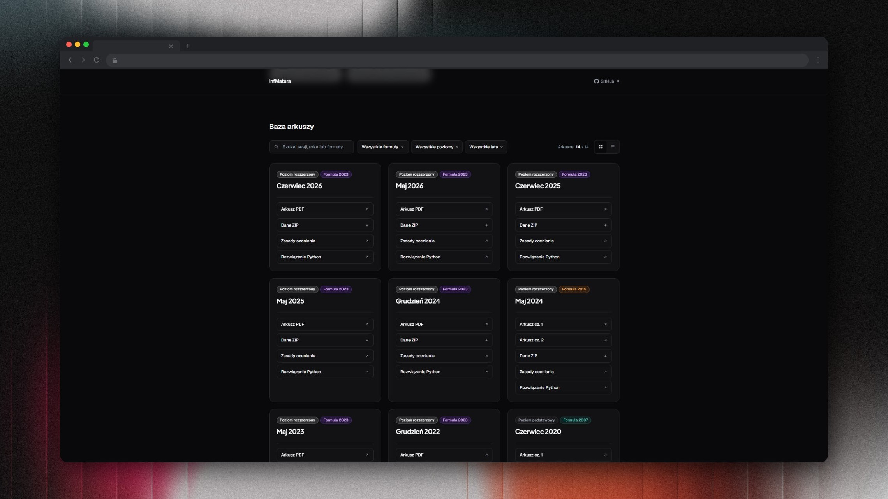
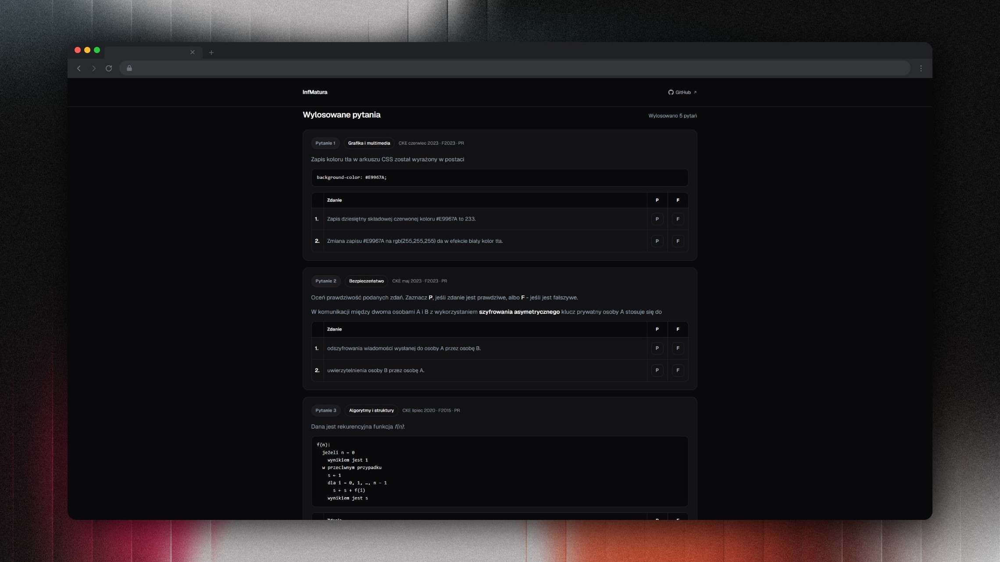

# matura-informatyka-rozszerzona

## Struktura

```
matura-informatyka-rozszerzona/
    ├── Algorytmy/
    ├── Arkusze/
    ├── MS_Access/
    ├── MS_Excel/
    ├── Python/
    └── SQL/
```

[](Algorytmy/)
[](Arkusze/)
[](MS_Access/)
[](MS_Excel/)
[](Python/)
[](MS_Access/SQL)

## Rozwiązania

> Kwerendy SQL do zadań znajdują się w plikach `.accdb` i `.sql`<br>Formuły do excela znajdują się w plikach `.xlsx`

### [infmatura.dev](https://infmatura.dev)

Wyszukiwarka arkuszy oraz testy z pytań teoretycznych.

[](https://infmatura.dev)
[](https://infmatura.dev/pytania-teoretyczne/)